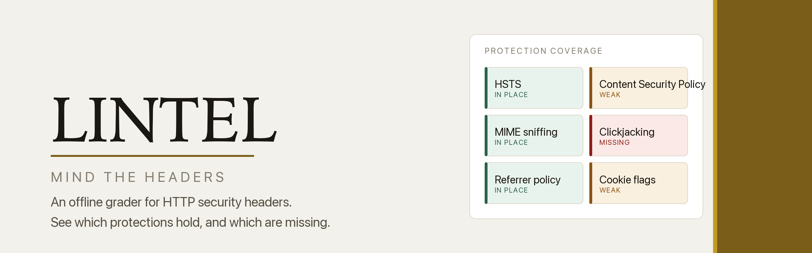
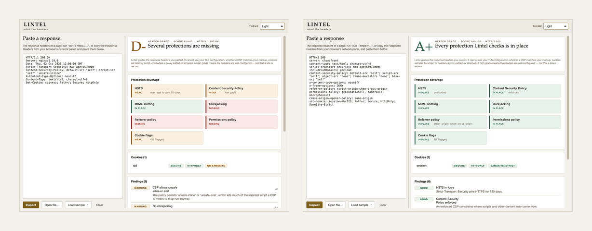

<div align="center">


<picture>
  <source media="(prefers-color-scheme: dark)" srcset="images/banner-dark.png">
  
</picture>

<br>

**Paste the headers a site sent back and Lintel grades the protections they carry — the headers alone, never the site.**

<br>


**[Lintel project site](https://at0m-b0mb.github.io/Lintel-HTTP-Headers/)**

</div>

---

## Why

Whether a browser will let your page be framed, run injected script, or drop back
to plain HTTP is not the browser's decision. The server makes it, in a few lines
at the top of every response that nobody reads. Leave one out and the browser
falls back to the permissive default — and the only evidence is a header that
isn't there.

Lintel reads those lines. Paste a response from `curl -I` or your browser's
network panel, and the seven defences that matter appear as tiles: green where a
protection holds, amber where it is undercut by an `unsafe-inline` or a 30-day
`max-age`, red where it is simply absent. The shape of a site's protection reads
before a word does. Below the grid sit your cookies with their flags, every
finding in plain words, and a letter from A+ to F.

<div align="center">
<picture>
  <source media="(prefers-color-scheme: dark)" srcset="images/screens-dark.png">
  
</picture>
<br>
<sub>A partly-configured nginx response (D-, 62/100) beside a hardened CDN one (A+, 100/100).</sub>
</div>

## The honest part

Lintel grades the headers you paste and nothing else. It cannot see your TLS
configuration, whether a CSP actually matches your markup, cookies your
JavaScript sets after the page loads, or what a proxy added or stripped on the
way to you. A high grade means the headers are well configured. It does not mean
a site is secure, and Lintel never uses that word as a verdict.

A+ is reserved for a response with nothing against it: every protection that
applies in place, nothing undercut, no version string leaking. Anything short of
that is capped at A. The thresholds are mainstream rather than personal: the
year-long `max-age` the preload list requires, a CSP without `unsafe-inline`,
cookies that are `Secure` and `HttpOnly`. Every penalty is printed with the
finding that earned it, so you can disagree with the arithmetic and still read
the facts.

## Install

```bash
git clone https://github.com/at0m-b0mb/Lintel-HTTP-Headers.git
cd Lintel-HTTP-Headers
python3 -m pip install -r requirements.txt   # just PyQt6, for the window
```

The engine and the command line need no dependencies at all — only the standard
library. PyQt6 is required solely for the graphical grader.

## Use

**The window:**

```bash
python3 -m lintel          # or:  python3 run.py
```

Paste a response, open a saved one, or load one of the four bundled samples.
Light, Dark and Auto are in the top-right.

**The command line** — same engine, no Qt, and it takes a pipe:

```bash
curl -sI https://example.com | python3 -m lintel -   # a live site's headers
python3 -m lintel samples/moderate.http              # a saved response
python3 -m lintel samples/moderate.http --json       # machine-readable
```

```
  D-   Several protections are missing  (62/100)
Lintel grades the response headers you pasted. It cannot see your TLS
configuration… not that a site is secure.

Coverage
  weak     HTTPS enforced (HSTS)  max-age is only 30 days
  weak     Content Security Policy  has gaps
  in place MIME sniffing blocked
  missing  Clickjacking blocked
  missing  Referrer leakage limited
  missing  Feature access limited
  weak     Cookie safety  0/1 flagged

Cookies (1)
  sid              Secure  HttpOnly  no-SameSite

Findings (9)
  [warning] CSP allows unsafe inline or eval -8
  [warning] No clickjacking protection -12
  [notice ] HSTS max-age is short -5
  …
```

Exit status is `0` for a reading and `2` when there was nothing to read — an
empty input, or a file that would not open.

## What it checks

| Protection | What Lintel wants to see |
|---|---|
| **HSTS** | `max-age` of at least a year, ideally `includeSubDomains; preload` |
| **CSP** | enforced, not report-only, with no `unsafe-inline`, `unsafe-eval` or wildcard source |
| **MIME sniffing** | `X-Content-Type-Options: nosniff` |
| **Clickjacking** | `X-Frame-Options: DENY`/`SAMEORIGIN`, or a CSP `frame-ancestors` |
| **Referrer** | a `Referrer-Policy` that stops short of sending the full URL |
| **Permissions** | a `Permissions-Policy` naming the features the page may use |
| **Cookies** | `Secure`, `HttpOnly` and a `SameSite`, checked per cookie |
| **Disclosure** | a version in `Server`, or an `X-Powered-By` advertising the stack |
| **Deprecated** | `Public-Key-Pins`, and `X-XSS-Protection: 1` |

The first seven are the coverage grid. The last two cost points and appear in the
findings without a tile of their own.

## Privacy

Lintel never touches the network. It opens no sockets and resolves no names — the
whole analysis is the standard library reading text you already have, so a
response you paste in stays on your machine. Fetching the headers is curl's job,
or your browser's. Lintel only reads them.

## Tests

```bash
python3 -m pip install -r requirements-dev.txt
python3 -m pytest -q
```

159 tests cover the parser (status lines, folded headers, a request block pasted
in by accident, repeated `Set-Cookie` lines), the protection checks, and the
grading pipeline against every sample. The contrast suite is most of that count:
it holds every text colour to WCAG AA on every background it can land on, in both
themes, so the palette cannot quietly regress.

## Layout

```
lintel/
  core/            the engine — pure standard library, no Qt
    model.py         the dataclasses everything speaks in
    parse.py         a pasted response  ->  a header set
    checks.py        one function per protection, each returning a tile
    grade.py         coverage, findings, and the letter, with the ceiling
  ui/
    theme.py         the design system: one place for every token
    coverage.py      the coverage grid — Lintel's signature element
    widgets.py       cards, chips, key/value rows
    main_window.py   the grader itself
  cli.py           the same engine on the command line
  app.py           the window's entry point
  __main__.py      python3 -m lintel — the window, or the CLI if given a file
samples/           hardened.http, good-cdn.http, moderate.http, default-server.http
tests/             test_parse, test_checks, test_grade, test_theme
tools/             capture_screenshots.py, brandkit.py
images/            the mark, banner, contact sheet and raw captures
run.py             opens the window
```

## Colophon

Set in Iowan Old Style for identity and the grade itself, the system sans for
anything you read, and a mono for the raw headers — Georgia and DejaVu Serif
stand in where Iowan is absent. The palette is warm paper and two golds: a deep
brass that survives being set small, and a brighter shine kept for marks that
carry no words. Dark mode is true black with nothing in the ramp that reads as
blue. Every colour is declared as a light/dark pair, and the test suite holds
each pairing to WCAG AA.

## License

MIT — see [LICENSE](LICENSE). A reader, for authorised, educational and personal
use. Every response in `samples/` is synthetic.
